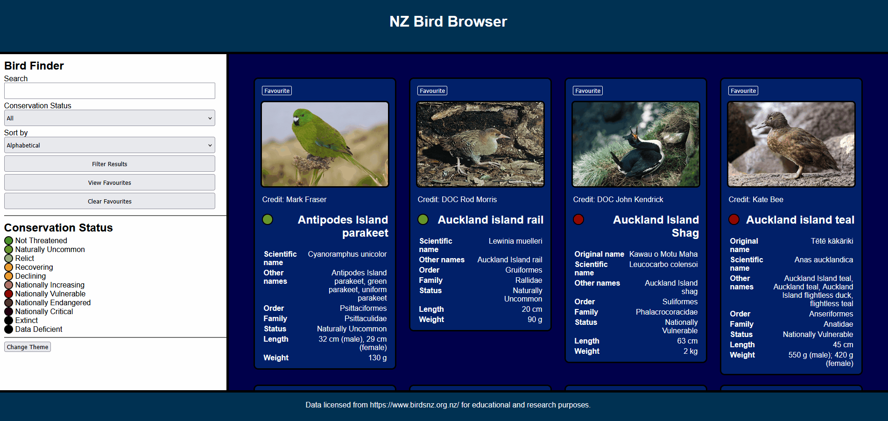

# NZ Bird Browser
> A web app for querying and saving New Zealand birds.

## General information
This project was developed as part of my second year coursework at the University of Otago, studying frontend web development. It provides an interface for querying JSON data describing a range of New Zealand bird species. While I have kept the repository private for academic integrity concerns, the source code is available to prospective employers upon request.

## Features
- Users can query birds based on both name and conservation status.
- JSON data is retrieved via JavaScript's Fetch API.
- Infoboxes containing bird information are dynamically added via JavaScript DOM manipulation.
- Search queries are normalised to NFC to support both English and Te Reo Māori input.
- Queries are checked against common, original, scientific, and other names.
- Birds can be marked as favourites and stored in persistent local storage, to be retrieved later.
- Users can switch between blue and red themes, which are applied to all elements in the DOM.

## Technologies used
- **Node.js**
- **HTML5**
- **CSS3**
- **JavaScript**
